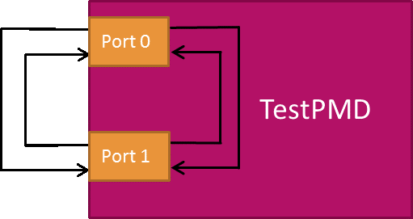

# BUILD ENVIROMENT DPDK
## 1. Config & build DPDK

__Build default enviroment DPDK__
```
$ make config T=x86_64-native-linuxapp-gcc #configure Target to build

$ make DESTDIR=[path/to/folder DPDK] prefix=[prefix] #default value of prefix=/usr/local

$ make install DESTDIR=[path/to/DPDK/folder]
```

___Example___: Build an simple application "helloworld"
```python
# Build app helloworld

$ cd examples
$ ls
# Khai báo biến môi trường rte_sdk
$ export RTE_SDK=`pwd`
# khai báo biến lưu folder đích khi build
$ export RTE_TARGET=x86_64-native-linuxapp-gcc
# Set cấu hình
$ make config T=$RTE_TARGET
# Build cấu hình
$ make -j8
# Cài đặt
$ make install T=$RTE_TARGET DESTDIR=install -j8
# Build app
$ cd examples/helloworld/
$ make
$ ./build/app/helloworld --help
# Run app
$ sudo ./build/app/helloworld --file-prefix thuong -l 0-4 
```
## 2. Config & build app Testpmd
Chức năng của Testpmd:
- Hai mô hình sử dụng

    

    

```python
$ cd ~/dpdk
# Khai báo biến môi trường rte_sdk
$ export RTE_SDK=`pwd`
# khai báo biến lưu folder đích khi build
$ export RTE_TARGET=x86_64-native-linuxapp-gcc
# Set cấu hình
$ make config T=$RTE_TARGET
# Build cấu hình
$ make -j8
# Cài đặt
$ make install T=$RTE_TARGET DESTDIR=install -j8
# Run app testpmd trên 2 card 0000:04:00.0 và 0000:04:00.1
$ sudo ./build/app/testpmd --file-prefix "thuong" -w 0000:04:00.0 -w 0000:04:00.1 -l 12,13,14 -n 4  -- -i
```
- Bắt đầu testpmd
```
>testpmd start
```
- Kết quả
```
io packet forwarding - ports=2 - cores=1 - streams=2 - NUMA support enabled, MP allocation mode: native
Logical Core 4 (socket 0) forwards packets on 2 streams:
  RX P=0/Q=0 (socket 0) -> TX P=1/Q=0 (socket 0) peer=02:00:00:00:00:01
  RX P=1/Q=0 (socket 0) -> TX P=0/Q=0 (socket 0) peer=02:00:00:00:00:00

  io packet forwarding packets/burst=32
  nb forwarding cores=1 - nb forwarding ports=2
  port 0: RX queue number: 1 Tx queue number: 1
    Rx offloads=0x0 Tx offloads=0x10000
    RX queue: 0
      RX desc=256 - RX free threshold=32
      RX threshold registers: pthresh=8 hthresh=8  wthresh=0
      RX Offloads=0x0
    TX queue: 0
      TX desc=256 - TX free threshold=32
      TX threshold registers: pthresh=32 hthresh=0  wthresh=0
      TX offloads=0x10000 - TX RS bit threshold=32
  port 1: RX queue number: 1 Tx queue number: 1
    Rx offloads=0x0 Tx offloads=0x10000
    RX queue: 0
      RX desc=256 - RX free threshold=32
      RX threshold registers: pthresh=8 hthresh=8  wthresh=0
      RX Offloads=0x0
    TX queue: 0
      TX desc=256 - TX free threshold=32
      TX threshold registers: pthresh=32 hthresh=0  wthresh=0
      TX offloads=0x10000 - TX RS bit threshold=32

```
- Show config

```
io packet forwarding - ports=2 - cores=1 - streams=2 - NUMA support enabled, MP allocation mode: native
Logical Core 4 (socket 0) forwards packets on 2 streams:
  RX P=0/Q=0 (socket 0) -> TX P=1/Q=0 (socket 0) peer=02:00:00:00:00:01
  RX P=1/Q=0 (socket 0) -> TX P=0/Q=0 (socket 0) peer=02:00:00:00:00:00
```
- Bắt đầu gửi packets   

- Show quá trình gửi packet
```
show port stats all
```

- Kết quả
```python
# Packets được gửi từ Port B của Traffic Generator, Port 1 nhận packets (RX) và chuyển tiếp packets qua Port 0, packets từ Port 0 truyền đi (TX) qua Port A.
  ######################## NIC statistics for port 0  ########################
  RX-packets: 0          RX-missed: 0          RX-bytes:  0
  RX-errors: 0
  RX-nombuf:  0         
  TX-packets: 1947850901 TX-errors: 0          TX-bytes:  241533511724

  Throughput (since last show)
  Rx-pps:            0          Rx-bps:            0
  Tx-pps:            0          Tx-bps:            0
  ############################################################################

  ######################## NIC statistics for port 1  ########################
  RX-packets: 1947852761 RX-missed: 33265762   RX-bytes:  245658696852
  RX-errors: 2
  RX-nombuf:  0         
  TX-packets: 0          TX-errors: 0          TX-bytes:  0

  Throughput (since last show)
  Rx-pps:            0          Rx-bps:            0
  Tx-pps:            0          Tx-bps:            0
  ############################################################################
```

- Stop & show total
```
Telling cores to stop...
Waiting for lcores to finish...

  ---------------------- Forward statistics for port 0  ----------------------
  RX-packets: 0              RX-dropped: 0             RX-total: 0
  TX-packets: 0              TX-dropped: 0             TX-total: 0
  ----------------------------------------------------------------------------

  ---------------------- Forward statistics for port 1  ----------------------
  RX-packets: 0              RX-dropped: 0             RX-total: 0
  RX-error: 2
  RX-nombufs: 0             
  TX-packets: 0              TX-dropped: 0             TX-total: 0
  ----------------------------------------------------------------------------

  +++++++++++++++ Accumulated forward statistics for all ports+++++++++++++++
  RX-packets: 0              RX-dropped: 0             RX-total: 0
  TX-packets: 0              TX-dropped: 0             TX-total: 0
  ++++++++++++++++++++++++++++++++++++++++++++++++++++++++++++++++++++++++++++

Done.
```


