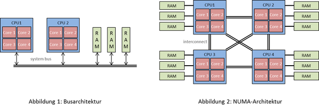
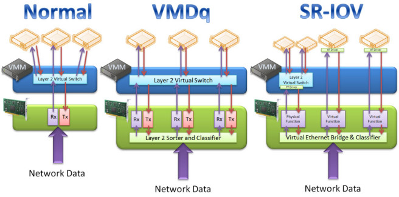

# TỔNG HỢP KIẾN THỨC CHỮA CHÁY
## ***Mục lục***
[1. CÁC KỸ THUẬT VỀ ẢO HÓA](#1)

- [1.1  Hyper Threading](#1.1)
- [1.2  Huge page](#1.2)
- [1.3  NUMA](#1.3)
- [1.4 SR-IOV](#1.4)

[2. TÌM HIỂU TỔ CHỨC MEMORY VÀ SLAB TRONG LINUX KERNEL](#2)

[3. CÁC KHÁI NIỆM MỚI](#3)

- [3.1 NAT](#3.1)

## 1.   CÁC KỸ THUẬT VỀ ẢO HÓA 

### 1.1 Hyper Threading:
Một công nghệ phần cứng được “trademarked” và được Intel thực hiện trên các bộ vi xử lý của họ – sẽ cho phép mỗi core shedule và thực thi 2 thread (có thể hơn, nhưng thường là 2) tại một thời điểm nhất định. Với hyper-threading, số lượng cores của CPU sẽ tăng lên gấp đôi.
Việc khai thác lợi thế của hyper-threading phụ thuộc vào cấu trúc chương trình. Có những chương trình được viết không nhằm sử dụng multi-threading, do đó mặc dù tại thời điểm đó có nhiều chương trình đang chạt nhưng chỉ có 1 CPU core đang hoạt động.
Hyper-threading sẽ thực sự hữu dụng và phát huy được khả năng nếu ta ứng dụng trong các ứng dụng nặng về video/audio coding, transcoding, các ứng dụng về khoa học được viết và thiết kế với việc sử dụng multi-threading nhằm mục đích đạt được throughput cao. Không đảm bảo cho việc tăng hiệu năng hệ thống, thậm chí tác động mạnh theo chiều hướng ngược lại (các thread có thể sử dụng chung các resources, do đó làm giảm hiệu năng).

### 1.2 Huge page:
Memory được quản lý trong các block dưới dạng page. Mỗi page có kích cỡ chuẩn 4KB. CPU có 1 đơn vị quản lý bộ nhớ (MMU – Memory Management Unit) bao gồm 1 list các page, mỗi page được trỏ đến thông qua một page table entry.
* Có 2 phương pháp:
    * Tăng số lượng các page table entry trong MMU
    * Tăng kích cỡ của page
    Phương pháp tăng số lượng các page table entry trong MMU phụ thuộc rất lớn vào sự phát triển của công nghệ vi xử lý – chip, các MMU trong các chip hiện tại chỉ hổ trợ khoảng hàng trăm đến hàng nghìn page table entry với chi phí cao. Ngoài ra, các thuật toán trong việc quản lý bộ nhớ và phần cứng hiện tại cũng chỉ hổ trợ số lượng trăm, nghìn page table entry, tạo sự khó khăn nhất định với hàng triệu, thậm chí hàng tỷ page table entry.
    Kích cỡ của page sẽ tăng lên với cấp số nhân của kích cỡ chuẩn (4KB) tùy thuộc vào mục đích sử dụng . Huge page có thể có kích cỡ từ 2MB tới hàng GB.
* Ưu điểm:
Huge page được pin trực tiếp tới bộ nhớ, do đó nó không bị swap in/out từ RAM. Điều này làm giảm overhead cho quá trình paging, tăng hiệu năng của hệ thống.
Huge page sẽ làm số lượng các page table entry giảm, TLB look ups sẽ hoạt động nhanh hớn trong việc tìm kiếm địa chỉ.
* Nhược điểm:
RAM sẽ bị tiêu thụ và đầy rất nhanh nếu không có quá trình swap. Việc sử dụng hugepage như thế nào cho hiệu quả tùy thuộc vào độ lớn ứng dụng, dịch vụ đang sử dụng. Ta có thể định nghĩa một phần RAM cho hugepage, số lượng RAM còn lại vẫn sử dụng cho page tiêu chuẩn.
Hugepage chỉ nên được ứng dụng với các workload sử dụng trực tiếp không gian hugepage của RAM, tránh trường hợp fragmented memory.

### 1.3 NUMA 
NUMA (Non-Uniform Memory Access): 
Một kiểu kiến trúc bộ nhớ máy tính nhằm hổ trợ cho hệ thống đa xử lý (multi processing) trong đó bộ nhớ (memory) thể hiện các đặc tính hiệu năng riêng biệt tại những điểm khác nhau trong không gian địac chỉ của CPU.
Để hiểu được NUMA, ta cần quay lại khái niệm về cấu trúc bộ nhớ chung (shared memory architecture). Cấu trúc này được chia làm 2 loại: Uniform Access Memory (UAM) và Non-Uniform Memory Access (NUMA). Với UAM, các CPU dùng bộ nhớ chung (shared memory). Để truy cập vào bộ nhớ này, CPU phải trải qua một quá trình khá phức tạp bao gồm giao tiếp với bộ điểu khiển I/O (I/O controller) thông qua bus. Bộ điều khiển này kết nối với Memory Controller – cấu trúc với chức năng như một hub kết nối với memory. Cấu trúc này có rất nhiều hạn chế về khả năng co giãn, latency hay băng thông. Ngoài ra CPU muốn kết nối với I/O controller phải chiếm được quyền kiểm soát bus tại một thời điểm nhất định (trong trường hợp multi-CPUs), điều này rất dễ gây ra vấn đề về tắc nghẽn trong truyền tải dữ liệu.

Để giải quyết các vấn đề về băng thông, tính co giãn hay latency, kỹ thuật NUMA được ra đời. Bản chất của NUMA chính là giảm khoảng cách giữa bộ nhớ và CPU dựa trên việc xác định vị trí của từng khu vực bộ nhớ theo độ dài đường tín hiệu (signal path lengh). Bằng phương pháp này, mỗi CPU sẽ được gán trực tiếp với một số lượng bộ nhớ nhất định (local memory). Bộ nhớ được kết nối với CPU khác được xem là bộ nhớ ở xa (remote memory). Việc kết nối giữa các CPU với nhau được gọi là inter-connection. Ví dụ CPU 1, CPU 2 đều có dung lượng bộ nhớ local là 2GB. Đối với CPU 1, 2GB bộ nhớ của CPU 2 được xem là remote memory. Việc truy cập vào remote memory cũng gây ra latency và overhead, do đó các tác vụ đều được ưu tiên sử dụng các local memory trước, sau đó là remote memory. Việc bộ nhớ được nằm rải rác về mặt hình học và sự truy cập dựa trên khoảng cách giữa local memory và remote memory được gọi là NUMA.

Quá trình ứng dụng kỹ thuật NUMA đòi hỏi sự hỗ trợ của hệ điều hành (operating system – OS). Nếu như OS hỗ trợ NUMA (NUMA phải được kích hoạt tại runtime và BIOS hoặc firmware phải xác nhận thông tin NUMA do đó NUMA có thể được điều khiển hay khởi động tại runtime với các thông số của kernel) thì ta có thể dễ dàng phân chia bộ nhớ dựa theo các ứng dụng một cách hiệu quả nhất nhằm đạt được kết quả cao về hiệu năng. Với một số ứng dụng cần hiệu năng cao, ta có thể sử dụng NUMA. Đối với những ứng dụng không đòi hỏi hiệu năng, ta vẫn có thể sử dụng phương pháp truy cập và cấp phát bộ nhớ thông thường.

### SR-IOV (Single Root I/O Virtualization):

Việc tăng hiệu năng của CPU trong môi trường ảo hóa đã có những bước tiến vượt bậc với sự phát triển của công nghệ, tuy nhiên hiệu năng của các thiết bị I/O vẫn còn là dấu hỏi. Kỹ thuật về SR-IOV được ra đời trong những năm gần đây sử dụng sự hỗ trợ từ các chip của Intel@ hay AMD sẽ phần nào giải quyết vấn đề này.

Bản chất của khái niệm ảo hóa platform chính là việc chia sẻ platform giữa 2 hoặc nhiều OS để tận dụng hiệu quả các loại tài nguyên (resources). Khái niệm platform không chỉ dừng lại ở những bộ xử lí mà còn bao trùm toàn bộ các tài nguyên như lưu trữ, mạng, v. v. , trong đó một số các tài nguyên như serial port hay video card thì việc tăng hiệu năng dường như là bài toán khó trong ảo hóa. PCI passthrough cho phép ta giải quyết vấn đề này.

Device virtualization được phân chia thành 2 cấu trúc: Hypervisor-based device emulation và User space device emulation. Trong cấu trúc của Hypervisor-based device emulation, các emulated devices như ổ đĩa ảo, adapter mạng ảo, etc. được nằm trong hypervisor và được chia sẻ bởi rất nhiều các Guest OS. Trong khi đó, cấu trúc User space device emulation bao gồm các emulated devices nằm trong không gian người dùng (user space) thay vì hypervisor. Điều này sẽ làm cho cấu trúc user space device emulation có nhiều ưu điểm hơn bởi vì các emulated devices sẽ độc lập hoàn toàn với hypervisor của Host OS, tránh việc ảnh hưởng trực tiếp đến khả năng bảo mật của Host hypervisor.

Cho dù ảo hóa mang lại nhiều lợi ích, nhưng đồng thời vẫn tồn tại overhead trong hệ thống ảo hóa. Càng nhiều Guest OS sử dụng chung các tài nguyên thì overhead càng cao. Passthrough là phương pháp làm giảm overhead với mục đích làm tăng hiệu năng cho một số nhóm Guest OS nhất định. Device passthrough cho phép các devices được kết nối trực tiếp với Guest OS mà không phải thông qua Host OS. Quá trình giao tiếp của devices với Guest OS thông qua Host OS mang lại rất nhiều overhead khi mà phải đi qua các driver trong Host hypervisor. Ngoài ra, có một số devices không có khả năng chia sẻ resource, do vậy việc tách biệt các device này dành riêng cho một nhóm Guest OS cụ thể là vô cùng cần thiết.

Tuy nhiên, giải pháp PCI passthough sẽ gặp phải vấn đề trong việc live-migration. Để physical devices có thể giao tiếp với các hypervisors của Guest OS, PCI hotplug driver (PCI hotplug driver là một tính năng được chuẩn hóa trong GNU/Linux từ kernel 2.4, cho phép thực việc các tác vụ đối với PCI device như insert/replace etc. mà không cần tắt nguồn hệ thống) cho phép các devices đi qua kernel của Host OS và kết nối tới hypervisor của Guest OS. Trong quá trinh live-migration, các devices phải được unplug từ Guest hypervisor cũ và sau đó plug in vào Guest hypervisor mới. Điều này vô cùng phức tạp nếu so sánh với phương pháp ảo hóa trong đó quá trình emulation cung cấp một tầng trừu tương (abstract layer) cho phép ta dễ dàng live-migrate các Guest machine.

Giải pháp hiện nay cho việc ảo hóa I/O chính là SR-IOV (Single-root I/O virtualization), được PCI-SIG (PCI-Special Interest Group) định nghĩa. Với sự hỗ trợ của SR-IOV ta có thể đạt được băng thông 10G Ethernet trong việc ứng dụng NFV (Network Function Virtualization). Ý tưởng của SR-IOV chính là việc replicate các resource của devices (các devices sẽ được nhóm thành các thực thể) để cung cấp các stream về ngắt, DMA (Direct Memory Access), không gian bộ nhớ cho từng máy ảo một cách riêng rẽ. Do đó, máy ảo có thể sử dụng trực tiếp các devices, dữ liệu có thể truyền giữa máy ảo và host mà không cần sự can thiệp của hypervisor.

Trong giải pháp SR-IOV, khái niệm VF (Virtual Function) được xuất hiện. VF là những thực thể PCI ‘lightweight’ bao gồm các resources cần thiết cho việc truyền dữ liệu giữa các máy ảo và devices. Trong mô hình này, passthrough sẽ không cần thiết bởi vì sự ảo hóa diễn ra tại các device cho phép hypervisor (thực chất là VMM – Virtual Machine Manager nằm trong hypervisor) map các VF tới không gian cấu hình (configuration space) của máy ảo. Việc mapping trực tiếp sẽ đem lại hiệu năng cao, giải quyết các vấn đề về bảo mật hoặc tính cô lập (isolation).

* Các ưu điểm của SR-IOV:

    * Số lượng ngắt tham gia trong qúa trình truyền dữ liệu ít đi.
    * Không cần sự can thiệp của hypervisor, giảm thiểu các overhead.
    * DMA tới không gian bộ nhớ của máy ảo.

## 2.   TÌM HIỂU TỔ CHỨC MEMORY VÀ SLAB TRONG LINUX KERNEL
Trong linux, memory được tổ chức thành các page chừng 4KB, tùy vào dòng CPU, hệ điều hành mà con số này có thể thay đổi, có thể lên đến 8KB hay 16KB một page. Trong khi CPU có thể thao tác đến từng byte, từng word nhưng đơn vị quản lý memory là page.

Có thể xem page size qua getconf PAGE_SIZE

Mỗi page memory có một page description, đây là một data structure mô tả về page đó, data structure này chừng 40 bytes. Nó chiếm một tỉ lệ rất nhỏ trong toàn bộ bộ nhớ. Page description sẽ mô tả trạng thái của page: lock hay dirty, số tham chiếu đến page cho biết page đang được sử dụng hay không, virtual address của physical page này.

Toàn bộ memory lại được chia thành các khu vực khác nhau phục vụ cho các mục đích khác nhau. Thông thường có 4 zone:
zone DMA: zone này chừng dưới 16M, là vùng bộ nhớ dành riêng cho DMA - Direct Memory Access. DMA có nghĩa là các device ngoại vi có thể truy cập trực tiếp vào memory qua một chip nhớ riêng mà không cần qua CPU. Tuy vậy CPU vẫn cần biết khu vực nào dành cho DMA để quy hoạch không chạm vào.
zone DMA32: zone này chừng nhỏ hơn 4G, là vùng bộ nhớ cũng cho DMA nhưng dành cho các 32 bits device.
Trên kiến trúc x86_64 có cả hai loại zone DMA và DMA32
zone NORMAL: Đây là vùng bộ nhớ thông thường.
zone HIGHMEM: Không rõ nó để làm gì.

Xem trong dmesg có thể thấy các thông tin về các zone này:
On node 0 totalpages: 8363847
DMA zone: 56 pages used for memmap
DMA zone: 104 pages reserved
DMA zone: 3835 pages, LIFO batch:0
DMA32 zone: 14280 pages used for memmap
DMA32 zone: 481252 pages, LIFO batch:31
Normal zone: 107520 pages used for memmap
Normal zone: 7756800 pages, LIFO batch:31
On node 1 totalpages: 8388608
Normal zone: 114688 pages used for memmap
Normal zone: 8273920 pages, LIFO batch:31

Mỗi page có chừng 4 KB, căn cứ số page có thể tính ra tổng số memory.
Ở trên có thể thấy kiến trúc CPU là kiểu NUMA, memory được chia ra quản lý bởi từng node. Mỗi node ứng với một CPU. Trong kiến trúc NUMA, CPU bên node0 vẫn có thể dùng memory trên node1 qua một internal link. Đối lập với NUMA là SMP - kiểu kiến trúc truyền thống, mọi CPU có toàn quyền access đến tất cả memory.

Ở trên có nhắc đến page descriptor, một loại data structure trong linux, nói chung data structure trong linux có nhiều loại và để nâng cao performance, linux có thực hiện một cơ chế để cache lại các data structure này. Cơ chế này được thực hiện bởi slab allocator. Hệ thống sẽ dành riêng một khu vực physical memory cho slab. Cấu tạo của slab layer được chia thành từng cache. Một cache là một tập hợp các data structure có cùng loại, chúng ta có cache cho inode và dentry, cache cho process descriptor... Mỗi cache gồm nhiều slab. Mỗi slab tương ứng với một hay nhiều physical memory liên tiếp nhau, mỗi slab lại gồm nhiều object, mỗi object sẽ được nạp một data structure, có thể coi một object tương ứng với một data structure. Slab có ba loại: full, empty, partial. Full nghĩa là slab đó toàn các object, partial nghĩa là nó có chứa một lượng object, empty là hoàn toàn chẳng có object nào. Slab allocator sẽ cấp phát object từ các slab cache. Nếu nhận một yêu cầu cần một instance, slab allocator sẽ xem có object nào trong slab thỏa mãn không, nếu có thì trả về luôn, nếu không, nó tạo một object mới trong slab, bắt đầu từ các partial slab, nếu không có partial slab, nó tạo trong empty slab, nếu cũng không có empty slab, nó tạo thêm một empty slab để tạo object trong đó. Hiển nhiên, nó không thể dùng full slab để tạo object được vì không còn chỗ nữa. Sau khi object này dùng xong, nó sẽ không được deallocate đi mà được đặt vào trong slab để tái sử dụng.

Mục đích của slab cache:

Cấp phát sẵn một continous physical memory dành cho data structure giảm hành vì allocate và deallocate memory, hạn chế phân mảnh memory sinh ra trong quá trình này.
Về mặt bản chất, cache là vùng data chứa các data đã được qua xử lý, process có thể dùng được luôn thay vì tái xử lý lại từ raw data. Có thể thấy từ đó mà có nhiều cache ở nhiều tầng khác nhau, slab cache, CPU cache…

Bản thân mỗi slab cũng có data structure gọi là slab descriptor, slab descriptor có thể nằm trong slab hoặc nằm ngoài slab, trong một general cache.

Có thể xem lượng slab qua:
slabtop
less /proc/slabinfo
less /proc/meminfo
atop

Thường lượng slab khá thấp chừng vài trăm MB, nếu quá nhiều đến hàng GB thì đó là vấn đề. Có một cách giải phóng lượng slab
echo 2 > /proc/sys/vm/drop_caches
inode và dentries object sẽ được xóa khỏi slab cache.

Inode là metadata của file
Dentry là các component của một path + file name, ví dụ file /usr/bin/test sẽ tạo ra 4 dentries: /, usr, bin và test.

## 3.   CÁC KHÁI NIỆM MỚI

### 3.1 NAT
