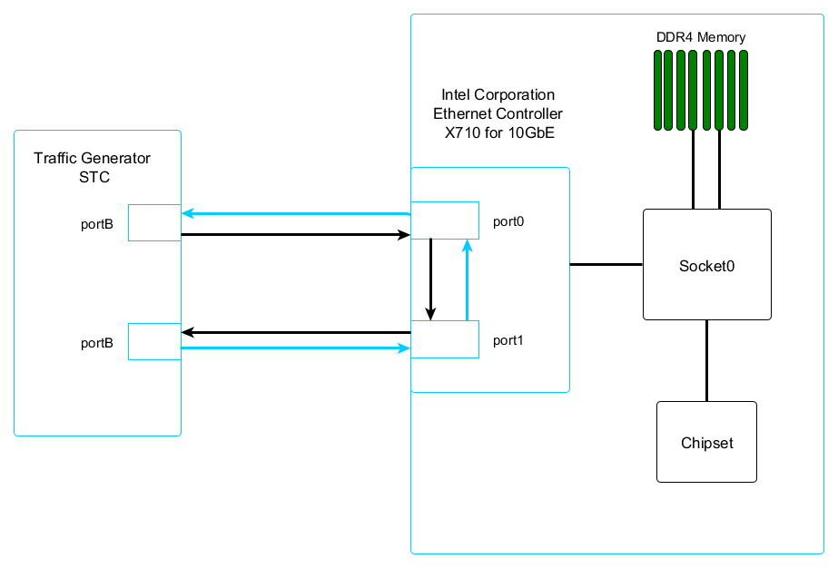

## Revision History 

| Revision | Date         | Author          | Description     |
| -------- | ----         | ----            | ----            |
|    1.0   | Dec 12, 2019 | Thuong Tran     | Initial version |

## Overview 

*Overview/introduction of your document.* 

## Test Setup

## Test Model

## Test Environment

### Hardware & Software Ingredients

|   Item    |   Description     ||
| ----------|-----------------  |
|   Server Platform     |   Asus Z10PE-D8 WS       |
|   CPU                 |   Intel(R) Xeon(R) CPU E5-2678 v3 @ 2.50GHz   https://ark.intel.com/content/www/us/en/ark/products/81908/intel-xeon-processor-e5-2680-v3-30m-cache-2-50-ghz.html   Number of cores: 48, Number of Threads:    |
|   Memory              |   Total  256GiB RIMM DDR4 Synchronous over 8 channels 2400 MHz  (0.4 ns)  |
|   PCIe                |   |
|   NICs                |   Intel (R) Ethernet Controller X710 for 10GbE SFP+ (4 x 10GbE)  
Chelsio Communications Inc T62100-CR Unified Wire Ethernet Controller (5 x 40/50/100Gb Ethernet)  
Intel (R) I210 Gigabit Network 4.15.0-63-genericrk Connection (2 x 1GbE) |
|   Operating System    |   Ubuntu 18.04.3 LTS  |
|   BIOS                |   12/18/2015 American Megatrends Inc. 3204    |
|   Microcode           |   0x43    |
|  Linux kernel version |   4.15.0-63-generic   |
|   Gcc version         |   gcc version 7.4.0 (Ubuntu 7.4.0-1ubuntu1~18.04.1) 7.4.0   |
|   DPDK version        |   18.11.5 |

### Boot and BIOS settings
|   Item                |   Description     ||
|--------------------   |-------------------|
|   BIOS Setting        |   ___default_hugepagesz=1G hugepagesz=1G hugepages=16 intel_iommu=on
iommu=pt isolcpus=1-21,28-48 nohz_full=1-21,28-48 rcu_nocbs=1-
21,28-48___  
Note: nohz_full and rcu_nocbs is to disable Linux* kernel interrupts, and it’s important
for zero-packet loss test. Generally, 1G huge pages are used for performance test.   |
|   BIOS                |   CPU Power and Performance Policy (Performance)   CPU C-state Disabled  
CPU P-state Disabled  
Enhanced Intel® Speedstep® Tech Disabled   Turbo Boost Disabled 
Intel VT Fordirected I/O(VT-d) Enable 
Intel Virtualization Technology (VT-x) Enable   |
|  DPDK Setting         |   Build Testpmd   |

|   Item                |   Description     ||
|---------------------  |   ------------    |
|   Test case           |   RFC2544 zero packet loss test on Intel (R) Ethernet Controller X710 for 10GbE (1GbE x 2)     |
|   NIC                 |   Intel(R) Ethernet Controller X710 for 10GbE     |
|   Driver              |   i40e DPDK PMD (base on igb_uio)    |
|   Device ID           |     8086:1572      |
|   Device Driver/       Driver version: 2.9.21  
Firmware                |   firmware-version: 7.10  xxx 11.2019  |
|   Test configuration  |   
|   Command line        |   sudo ./build/app/testpmd --file-prefix "thuongtxt" -w 0000:04:00.0 -w 0000:04:00.1 -l 12,13,14 -n 4  -- -i

## Test Result

|   Packet Size(Bytes)  |   Throughput(Mpps)    |   Line rate%   ||
|   -----------------   |   ----------------    |   ----------   |
|   64                  |   14.85               |   |
|   128                 |   8.41                |   |
|   256                 |   4.51                |   |
|   512                 |   2.34                |   |

## Figure3: RFC2544 zero packet loss test on Intel® Ethernet Converged Network Adapter X710-DA4 

## References

*All external references goes here.* 

## About Arrive 

Arrive is a broadband semiconductor solutions company with a broad portfolio of
highly integrated systems-on-a-chip products combining voice, data, Internet and
multimedia content for worldwide telecommunications companies.

Our CodeChip� replaces inflexible fixed-silicon ASICs with a programmable
carrier-class FPGA solution.  It includes a SoC FPGA Image with a full software
development kit, including APIs and Drivers, and is backed by the integration
and testing experience of Arrive.

For more information on our Carrier Ethernet CodeChip� product, go to:
[www.arrivetechnologies.com/af5/](http://www.arrivetechnologies.com/af5/)

<table class="columns" style="font-size:1em;margin-bottom:10px;margin-top:30px"> <tr> <td>

<b>North America Headquarters</b> 
4031 White Mill Crescent Road 
Roseville, CA 95747 
USA 
(888) 864-6959

</td> <td style="text-align:right"> 

<b>Vietnam</b> 
Floor 10, E-Town Building, 
364 Cong Hoa Street 
Ward 13, Tan Binh District, 
Ho Chi Minh City, Vietnam

</td> </tr> </table>

<!-- End of document -->
